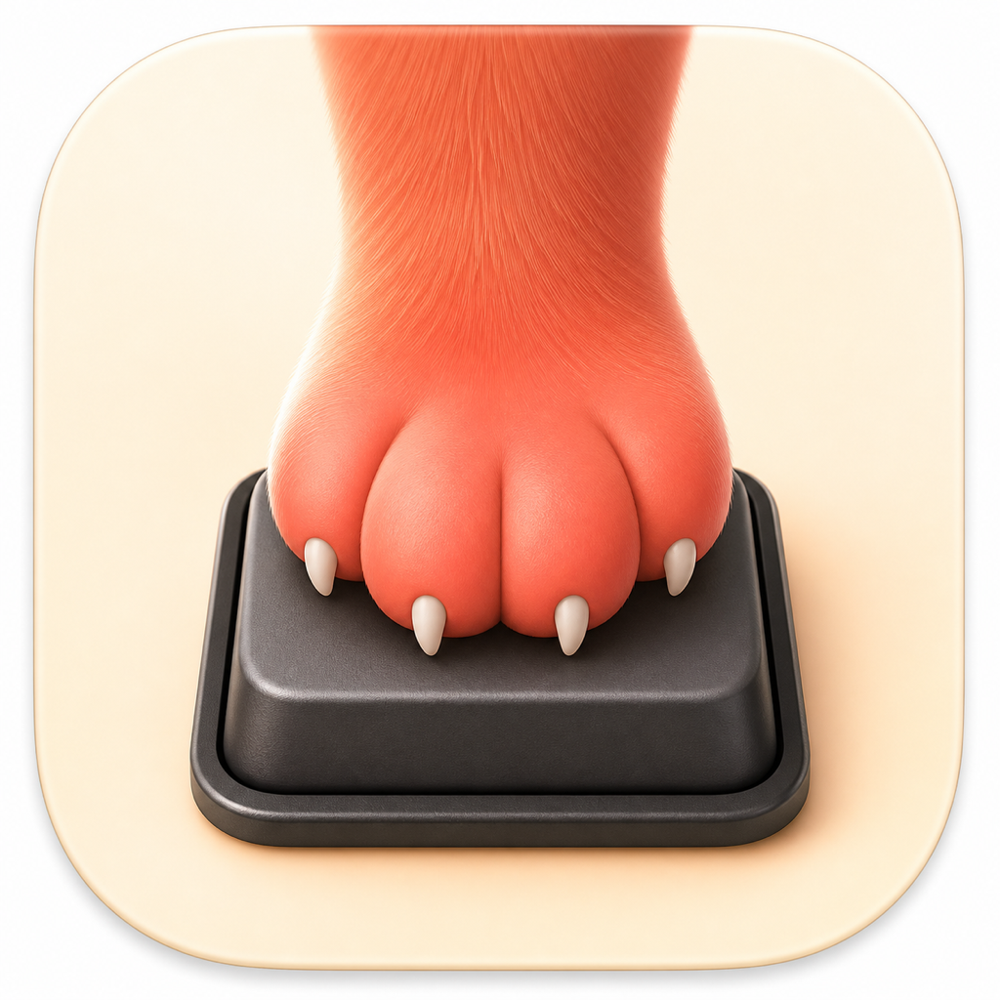

# CatGuard

<p align="center">
  
</p>

CatGuard is a native macOS menu-bar app that prevents cats from pressing keys,
clicking, dragging, or scrolling while a chosen Focus is active—without locking
the Mac or blocking trusted Computer Use automation.

> [!IMPORTANT]
> CatGuard protects against the **feline** threat model: paws on keyboards and
> pointing devices. It does not protect a Mac from people, malware, theft, or
> deliberate physical access, and it is not a replacement for the macOS lock
> screen. The rescue phrase is a convenience fallback, not a security password.

> [!CAUTION]
> **Do not blindly install someone else's CatGuard binary.** CatGuard is
> intentionally invasive. It receives system-wide physical keyboard and pointer
> events through Input Monitoring and can suppress them through Accessibility.
> A malicious build could be a keylogger or sabotage input in every application.
> This implementation does not store or transmit typed keys: it counts key-downs
> and compares letter positions with an in-memory rescue-phrase matcher. You
> should inspect and build the source yourself—or ask Codex to do that inspection
> and create a fresh build signed for your Mac—instead of trusting this claim.

The idea came from a real problem: an unlocked Mac is useful for overnight AI
tasks, but an unattended keyboard is irresistible to cats. Locking the Mac stops
the cats, but also changes how local automation can interact with the GUI.
CatGuard narrows the intervention to physical input and leaves synthetic
Computer Use events alone.

## What it does

- Follows a macOS Focus Filter while running in the background.
- Shows a green paw when input is active, a red lock when guarded, a green open
  lock while bypassed, and an orange warning when protection is unavailable.
- Suppresses physical keyboard key-down, key-up, and modifier events.
- Suppresses physical pointer clicks, drags, and scrolling. The cursor can still
  move, which is harmless for the feline threat model.
- Passes nonphysical Computer Use interaction through while guarded.
- Bypasses on a one-pointer circle drawn with an ordinary mouse or trackpad.
- Provides an editable, Keychain-backed rescue phrase as a fallback.
- Can be armed manually without a Focus. The latch survives Focus changes and
  clears only after a circle or rescue-phrase bypass (or app exit).
- After a Focus-mode bypass, re-arms after five continuous minutes without
  physical input. Activity restarts that idle period.
- Names the bypass trigger in its live status—pointer circle, rescue phrase, or
  menu command—so an unexpected release is visible rather than mysterious.
- On Focus end, reports blocked keyboard key-downs and pointer clicks separately,
  with the bypass count first when nonzero. Movement is not counted.
- Fails open: exiting or crashing destroys the event tap and restores input.

The fresh-install rescue phrase is `catguard`. It uses physical ANSI/QWERTY
letter positions rather than the active keyboard layout. Counts represent input
events, not distinct cats or visits.

CatGuard runs entirely in the logged-in user session. It does **not** install a
root helper, request an administrator password, or use a kernel/system extension.

## Current status

The physical-versus-synthetic boundary, circle bypass, and input suppression
have been exercised on a real external Apple keyboard and Magic Trackpad on
macOS 26. The earlier low-level HID approach and the reason it was rejected are
recorded in [the experiment log](docs/HID-EXPERIMENTS.md).

**This repository does not publish a prebuilt app.** The maintainer's Apple
Personal Team cannot issue the Developer ID certificate required for a properly
signed and notarized public release. More importantly, a signature identifies a
publisher; it does not prove that globally input-capable software is safe.
Building an inspected copy remains the recommended path.

## Local setup

1. Review the source and build CatGuard using one of the options below.
2. Move your built `CatGuard.app` to `/Applications` and open that copy.
3. Grant `CatGuard.app` both **Input Monitoring** and **Accessibility** in
   **System Settings → Privacy & Security**. If you add it manually, select the
   copy in `/Applications`.
4. In **System Settings → Focus**, edit the desired Focus, choose **Focus
   Filters**, add CatGuard, and enable **Guard against cat input**.
5. Optionally enable **Start CatGuard at login**, customize the rescue phrase,
   or disable circle bypass.

The Focus can still be controlled from the Mac, iPhone, or Apple Watch. CatGuard
only reacts to its associated filter.

## Recovery paths

- Draw a closed circle with one pointer.
- Type the configured rescue phrase on the guarded keyboard.
- Disable the activating Focus from the Mac, iPhone, or Apple Watch.
- Quit CatGuard from its menu-bar menu.
- Force-quit it if necessary; process exit destroys the event tap immediately.
- Disconnecting the keyboard remains a physical last resort.

Disabling a Focus does not clear a manual-arm latch. That is deliberate: use a
circle or rescue phrase to clear manual arm. If Focus is also active, a bypass
lasts until five continuous minutes of physical-input inactivity.

## Build from source

Requirements: macOS 14 or newer, Xcode 26, and
[XcodeGen](https://github.com/yonaskolb/XcodeGen).

```sh
brew install xcodegen
xcodegen generate
open CatGuard.xcodeproj
```

Add your Apple Account to Xcode and select its Personal Team for the CatGuard
target. A Team-signed development build enables the App Intent used by Focus
Filters:

```sh
./scripts/build-development.sh
open .build/xcode-team/Build/Products/Release/CatGuard.app
```

Then copy the app to `/Applications` before granting permissions and configuring
the Focus Filter. Xcode manages this development identity; it is not suitable
for redistribution and may need renewal by Xcode in the future.

For manual arm without Focus integration, the local script creates a ten-year,
Keychain-backed certificate trusted only on the current Mac:

```sh
./scripts/build-local.sh
open .build/xcode-local/Build/Products/Release/CatGuard.app
```

A self-signed app may appear in the Focus Filter picker with its **Add** button
disabled because App Intents require an Apple-validated bundle with a Team ID.

Changing signing identities can invalidate old privacy rows even when the bundle
ID stays the same. If CatGuard shows orange after a rebuild, remove and re-add
the `/Applications/CatGuard.app` copy in both Input Monitoring and Accessibility,
then relaunch it. Ordinary rebuilds with the same identity should retain access.

Reusable state machines and research utilities use Swift Package Manager:

```sh
swift build
swift test
```

The package includes two deliberately separate research tools:

- `catguard` is an earlier camera/Bluetooth presence prototype. It is not used
  by the production app and never disables input.
- `catguard-hid-test` is the diagnostic that produced the HID and event-tap
  evidence. Its seizure modes impose hard time limits.

Read [the experiment log](docs/HID-EXPERIMENTS.md) before running the latter
with `sudo`.

## Architecture

One user-session Core Graphics event tap filters empirically identified physical
PID-0 events. Its in-memory policy handles keyboard suppression, pointer action
suppression, circle detection, rescue matching, session counts, and bypass idle
activity. Synthetic events with a process identity pass through.

See [the agent build guide](docs/AGENT-BUILD-GUIDE.md),
[Architecture](docs/ARCHITECTURE.md),
[HID experiments](docs/HID-EXPERIMENTS.md), and the
[early design history](docs/IDEA.md) for details.

## Ask Codex to build your variant

**This is the recommended installation path.** Give Codex the following prompt
so it can audit the design, adapt it to your hardware, and build a copy under an
identity you control:

```text
Build me a native Swift macOS menu-bar app inspired by CatGuard. Its threat model
is accidental feline input only, never human security. While a configured Focus
Filter is active, suppress physical keyboard events and physical pointer clicks,
drags, and scrolling, but preserve trusted synthetic Computer Use events. Use a
user-session Core Graphics filtering event tap and only an empirically verified
physical-event classifier; do not install a root helper, daemon, kernel extension,
or system extension. Keep pointer movement available for a mouse/trackpad circle
bypass. Add a Keychain-backed rescue phrase matched in memory from physical key
positions, and re-arm only after five continuous minutes of physical-input
inactivity while Focus remains active. On Focus end, notify me of keyboard
key-down and pointer-click counts separately, putting bypass count first when
nonzero. Fail open on every permission, tap-creation, crash, and exit path. Never
store, log, or transmit input contents. Include unit tests, clean documentation,
hard-timed hardware experiments, and an emergency recovery path before enabling
it on my real keyboard. Audit every global-input capability and sign the build
with an identity controlled by me rather than trusting a downloaded binary.
```

Do not copy CatGuard's team ID or bundle identifiers. Re-run the
physical-versus-synthetic boundary tests on the exact macOS release and hardware
where the app will run.

## License

[MIT](LICENSE). Built for cat people, AI nerds, and the considerable overlap
between those populations.
